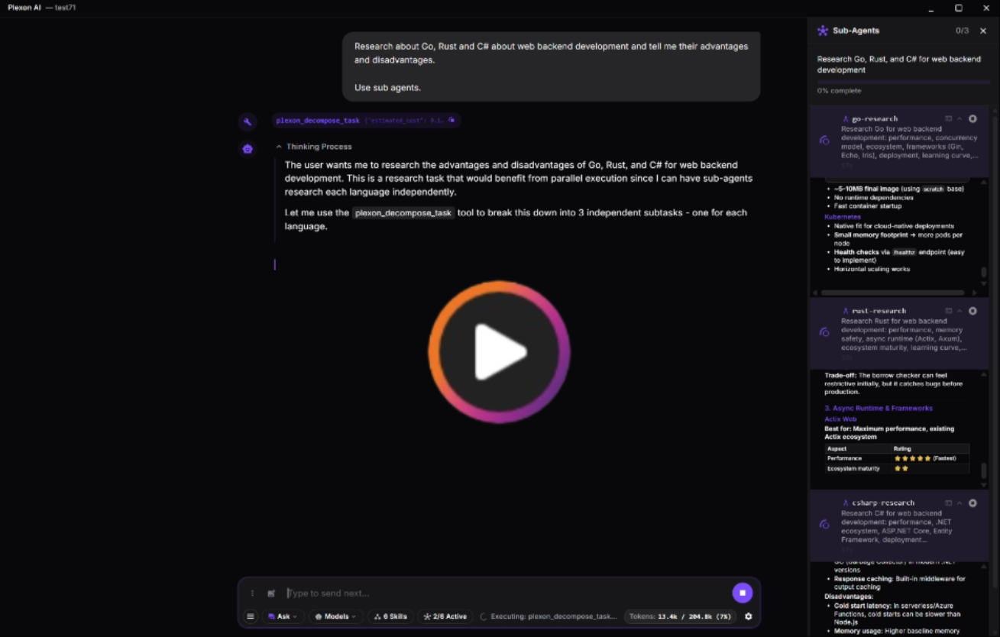

<div align="center">
  
  <h1>Plexon AI</h1>
  <p><strong>The Neural Network for Your Codebase</strong></p>
  <p>Privacy-first AI coding assistant for Windows, macOS, and Linux</p>

  <a href="https://plexon.ai"></a>
  <a href="https://github.com/hellenic-development/plexon.ai/releases"></a>
  <a href="https://github.com/hellenic-development/plexon.ai/issues"></a>
  
</div>

<br />

<div align="center">
  <a href="assets/demo.mp4">
    
  </a>
  <p><em>Click to watch the demo video</em></p>
</div>

## Overview

Plexon AI is a privacy-first desktop application that brings AI-powered coding assistance directly to your machine. Built with Electron and React, it operates under a zero-knowledge architecture where your code never leaves your device. The stateless server retains nothing between requests. Available on Windows, macOS, and Linux with full feature parity across all platforms.

- **Four specialized AI modes** with automatic parallel orchestration and custom agent creation
- **Zero-knowledge privacy** with AES-256-GCM encryption and no server-side state retention
- **Eight AI providers** including Anthropic, OpenAI, Google, KIMI, Z-AI, MiniMax, OpenRouter, and Claude Desktop
- **Browser automation and Desktop Pilot** for full computer and web control
- **Fully integrated source control** with staging, diffs, commits, and AI-generated commit messages
- **10-20x faster checkpoints** than Git with automatic per-file backups in 5-10ms

## Table of Contents

- [Key Features](#key-features)
  - [AI Modes](#ai-modes)
  - [Custom Agents](#custom-agents)
  - [Multi-Provider AI Support](#multi-provider-ai-support)
  - [Source Control](#source-control)
  - [Browser Automation](#browser-automation)
  - [Desktop Pilot](#desktop-pilot)
  - [Advanced File Operations](#advanced-file-operations)
  - [Checkpoint and Backup System](#checkpoint-and-backup-system)
  - [Skills System](#skills-system)
  - [Code Search and Intelligence](#code-search-and-intelligence)
  - [MCP (Model Context Protocol)](#mcp-model-context-protocol)
  - [Extended Thinking](#extended-thinking)
  - [Voice Input and Output](#voice-input-and-output)
  - [Telegram Bot](#telegram-bot)
  - [Context Intelligence](#context-intelligence)
  - [Context Condensation](#context-condensation)
  - [Mini Mode](#mini-mode)
- [More Features](#more-features)
- [Security and Privacy](#security-and-privacy)
- [Performance](#performance)
- [Platform Support](#platform-support)
- [Getting Started](#getting-started)
- [Contributing](#contributing)
- [Links](#links)
- [License](#license)

## Key Features

### AI Modes

| Mode | Description | Access |
|------|-------------|--------|
| Code | Write and modify code, implement features, fix bugs, refactor | Read/Write |
| Architect | Generate 2-5 design options with trade-off analysis | Read-only |
| Ask | Explanations, documentation, concept learning | Read-only |
| Autonomous | Hands-free implementation with self-correction and quality validation | Read/Write |

**Code** mode is the default for day-to-day development. It reads your project context and writes code directly into your files with full read/write access.

**Architect** mode generates multiple design proposals with pros, cons, and trade-off analysis. It operates in read-only mode so you can explore options before committing to an approach.

**Ask** mode explains code, generates documentation, and helps you learn new concepts without modifying your files.

**Autonomous** mode takes over entire tasks end-to-end. It plans, implements, and self-corrects with built-in quality validation (70% threshold) across configurable cycles. No interactive questions are asked during execution.

Complex tasks are automatically decomposed into parallel subtasks with dependency-aware scheduling and concurrent sub-agent execution. Results are synthesized back into a single coherent output with full cost tracking.

### Custom Agents

Create your own specialized agents with fine-grained control over behavior, tools, and context. Define agents in `~/.plexon/subagents/<agent-name>/AGENT.md` using Markdown with YAML frontmatter:

```yaml
---
name: api-reviewer
description: Reviews REST API implementations
modes: [code, ask, architect]
tools: [plexon_code_search, plexon_read_file]
disallowedTools: [plexon_write_file]
skills: [api-best-practices]
maxTurns: 25
costBudgetUSD: 2.5
icon: "\U0001F50D"
color: "#FF6B6B"
providerName: anthropic
model: claude-sonnet-4-6
filePatterns: ["api/**/*.go", "routes/**/*.go"]
enabled: true
---

You are an API review specialist...
```

- **Invoke by mention** with `@agent-name` in chat or let the orchestrator auto-assign agents to subtasks
- **Per-agent tool restrictions**, skill references, token budgets, and cost limits
- **Provider and model overrides** per agent
- **File pattern matching** for context-aware auto-activation
- **Full management UI** with icon/color picker and mode selection

### Multi-Provider AI Support

| Provider | Models | Best For |
|----------|--------|----------|
| Anthropic | Claude Opus 4.6, Sonnet 4.6/4.5, Haiku 4.5 (up to 1M context) | Full-featured coding with prompt caching |
| OpenAI | GPT-5.4 Pro, GPT-5.3, GPT-4o, and 60+ models | Extended thinking, audio models |
| Google | Gemini 3.1 Pro/Flash, Gemini 2.5, and 27+ models | Vision, video, 1M context |
| KIMI | K2.5, K2 Thinking, K2 Turbo (256K context) | Cost-effective with built-in web search |
| Z-AI | GLM-5, GLM-4.7, CogView-4, CogVideoX-3 | Image and video generation |
| MiniMax | M2.5 with high-speed variants | Vision and reasoning |
| OpenRouter | 337+ models from all major providers | Flexibility, free-tier models |
| Claude Desktop | Local Claude models | No API key required, uses local app |

Bring your own API key for any supported provider. Switch between models per conversation, per message, or set defaults per mode. Each provider's unique capabilities (prompt caching, web search, extended thinking, image/video generation) are automatically available.

### Source Control

A fully integrated, VS Code-style source control panel built directly into the sidebar:

- **Stage and unstage** files individually or in bulk
- **View unified diffs** with syntax highlighting, line numbers, and color-coded additions/deletions
- **Commit changes** with a dedicated message editor and keyboard shortcuts (Ctrl+Enter)
- **AI-generated commit messages** in conventional commit format, referencing your recent commit history for style consistency
- **Discard changes** with safety confirmation dialogs
- **File status badges** (Modified, Added, Deleted, Renamed, Copied, Unmerged, Untracked) with addition/deletion line counts
- **Repository initialization** with protected directory detection (prevents accidental `git init` in system folders)
- **Auto-refresh** on file system changes with debounced updates
- **Keyboard navigation** through file lists with Arrow keys and Enter

### Browser Automation

Control Chrome or Chromium directly from the chat interface using your real browser profiles and authenticated sessions. Plexon AI captures screenshots and analyzes them with vision models to understand page state, then executes precise actions:

- Navigate, click, hover, type, press keys, scroll, and resize the viewport
- Console log monitoring and JavaScript execution in browser context
- Coordinate scaling for accurate element targeting
- Interactive approval workflow for every browser launch
- Configurable headless mode, viewport size, screenshot quality, and timeouts

### Desktop Pilot

Full cross-platform desktop automation with 18 distinct actions:

- **Mouse control**: move, click (left/right/middle/double/triple), drag, scroll with modifier support
- **Keyboard input**: individual keys, key combos, text typing, hold keys
- **Screen capture**: screenshots with cursor overlay, region-level zoom inspection
- **Window management**: list windows, get cursor position, wait/pause
- Platform-specific backends: Win32 APIs (Windows), cliclick + osascript (macOS), xdotool + wmctrl (Linux)

### Advanced File Operations

- 30 concurrent file workers delivering 3-5x faster throughput
- Batch atomic operations processing up to 64 files per request
- Precise SEARCH/REPLACE write strategy for minimal diffs
- Automatic gitignore respect across all operations

### Checkpoint and Backup System

- Automatic backup on every file modification with 5-10ms latency per file
- Multi-file checkpoint snapshots with atomic restore to any point in time
- 10-20x faster than Git with zero Git dependency
- AI-integrated restore: ask the AI to list, compare, or restore backups from chat
- Configurable retention policy (default: last 10 backups per file, last 20 checkpoints, 7-day max age)

### Skills System

- Markdown files with YAML frontmatter, 100% compatible with the Claude CLI skill format
- Lazy loading at 50 tokens per skill, supporting 100+ skills without context bloat (3-5x more token efficient)
- AI-assisted skill creation from chat: describe what you want and the AI generates the skill file
- Project-local storage in `.plexon/skills/`, version controlled and team-shareable via Git
- Skill categories: coding standards, framework patterns, testing workflows, git conventions, domain knowledge

### Code Search and Intelligence

- **LSP integration** for 10+ languages: Go, Python, TypeScript/JavaScript, Java, C/C++, Rust, Ruby, PHP, C#, Swift
- **Semantic symbol search**: workspace symbols, go-to-definition, find references, hover information
- **Hybrid backend**: LSP-first with automatic regex fallback when LSP is unavailable
- **Fast regex search**: parallel file scanning (200-500ms), symbol kind filtering, file glob patterns
- Auto-install LSP servers on first use

### MCP (Model Context Protocol)

- 25+ built-in tools available out of the box
- Multiple MCP server auto-start on daemon launch with hot-reload on configuration changes
- Pre-configured servers for filesystem, GitHub, Slack, and more
- Provider-linked MCP servers with automatic API key injection
- Full resource access, prompt templates, and HTTP OAuth support

### Extended Thinking

- Per-message toggle via message options menu or global defaults in settings
- Configurable thinking budget (max tokens for reasoning)
- Supports Anthropic Claude, OpenAI o1/o1-mini, and Gemini Flash Thinking models
- Adaptive activation: auto-suggests thinking for complex queries (algorithms, optimization, debugging, architecture)
- Collapsible reasoning display with separate token tracking

### Voice Input and Output

- **Speech-to-text** via local Whisper (whisper.cpp with GPU/CUDA support), multiple model sizes from tiny to large-v3-turbo
- **Text-to-speech** using system voices, with playback rate control (0.5x-2.0x), pause/resume/stop
- **Audio notifications** for message sent, received, questions, errors, and success events
- Model download management from HuggingFace with automatic language detection

### Telegram Bot

Control Plexon AI remotely from any Telegram client. The built-in bot connects via long-polling (no webhook server required, works behind firewalls) and provides full access to your coding sessions:

- **12 commands**: /start, /help, /new, /clear, /stop, /status, /retry, /switch, /mode, /usage, /delete, /exit
- **Session management**: each Telegram chat maps to an independent session with persistent chat-to-session mapping, create/switch/delete sessions on the fly
- **Mode switching**: switch between Code, Architect, Ask, and Autonomous modes with `/mode <name>`
- **Image support**: send photos with captions as input, receive AI-generated images (local files, remote URLs, or base64) as Telegram photos, with automatic markdown image extraction from responses
- **Live tool notifications**: real-time tool execution status with duration and success/failure indicators in a single continuously-updated message
- **Interactive prompts**: inline keyboard buttons for AI questions with 10-minute timeout, credential prompts for tools that need API keys
- **Usage tracking**: per-session token breakdown (prompt/output/total) and cost display via `/usage`
- **Auto-start**: configure `telegram.enabled: true` and the bot starts with the daemon, restoring previous chat-session mappings

### Context Intelligence

Plexon AI automatically understands your project before you type a single message. On session start, it scans your working directory to build a rich project context that shapes every AI interaction:

- **Language detection**: identifies Go (go.mod), JavaScript/TypeScript (package.json), Python (setup.py/pyproject.toml), and more by scanning for signature files
- **Framework detection**: recognizes React, Vue, Django, Flask, Express, Spring Boot, and other frameworks from dependencies and project structure
- **Dependency analysis**: parses go.mod, package.json, and other manifests to extract your dependency tree
- **Directory tree generation**: produces a gitignore-aware visual file structure so the AI understands your project layout without reading every file
- **Entry point detection**: identifies main files (main.go, index.js, app.py) to help the AI understand code flow
- **Custom instructions via `.plexon/STATE.md`**: define project-specific guidelines, conventions, business logic, and domain knowledge that the AI follows in every response
- **Custom prompts**: place additional `.md` files in `.plexon/prompts/` for per-project instructions that are injected into every AI request
- **Project documents**: automatically loads TASKS.md, PLANNING.md, STATE.md, and PRD.md from your `.plexon/` directory for full project awareness
- **Lightweight design**: only metadata and structure are sent initially; file contents are loaded on-demand by the AI to preserve context window space

### Context Condensation

Intelligent conversation management that keeps long sessions productive without hitting context limits:

- **Automatic trigger**: when conversation tokens reach 60% of the effective context window, condensation is considered; at 90%, it activates unconditionally
- **LLM summarization**: the primary method sends older messages to the planning model, which generates a concise summary preserving key decisions, code changes, and context -- replacing multiple messages with a single summary
- **Sliding window fallback**: if summarization fails, falls back to truncation that preserves the first message (original task) and the most recent messages, adding a marker explaining the trim
- **Smart preservation**: recent messages are always kept intact (configurable, default 2), and the original task message is never removed
- **Token buffer**: a 10% reserve is maintained below the hard context limit to prevent overflow
- **Manual trigger**: force condensation at any time through the UI, with a safety floor (60% minimum usage) to prevent unnecessary loss of context
- **Context usage tracking**: real-time metrics available to the UI showing current tokens, effective limit, usage percentage, and whether condensation is imminent

### Mini Mode

A compact, focused interface for quick interactions without leaving your workflow:

- **Reduced footprint**: narrower sidebar (220px vs 290px), smaller header (40px vs 56px), scaled-down fonts and icons, and reduced message spacing
- **Title bar hidden**: the title bar is completely removed in mini mode to maximize vertical space for conversation
- **Always-on-top**: pin the window above all other applications so it stays accessible while you work in your editor or terminal
- **Full feature parity**: all chat, tool execution, mode switching, file operations, and sub-agent capabilities remain available
- **Smart sidebar behavior**: sidebar auto-closes when entering mini mode and resets to the compact 220px width; drag-to-resize is available within mini-mode bounds (160-400px)
- **State persistence**: mini mode setting, window position, dimensions, sidebar state, and always-on-top preference are all saved and restored across restarts
- **Keyboard shortcuts**: Alt+Shift+M to toggle mini mode, Alt+Shift+T to toggle always-on-top

## More Features

<details>
<summary>Click to expand</summary>

| Feature | Description |
|---------|-------------|
| Image and Video Generation | Generate images and videos through Z-AI CogView-4/CogVideoX-3 and other capable models, with per-unit pricing display |
| Task Management | Built-in TODO system with pending, in-progress, and completed status indicators in the sidebar |
| 11 Themes | Terminal Zero, Gruvbox, Omni, Monokai Pro, Dracula, Nord, Solarized Dark, Titanium Slate, Cosmic Intelligence, Light, Dark |
| Cost Management | Real-time token and cost display per request and session, cache hit savings, and budget limits for orchestrator mode |
| Session Management | AES-256-GCM encrypted sessions, multi-conversation support, search, export/import JSON, message editing and replay |
| Keyboard Shortcuts | Sidebar panels (Ctrl+/), zoom (Ctrl+/-/0), mini mode (Alt+Shift+M), always-on-top (Alt+Shift+T), screenshot (Ctrl+Shift+S), session switching (1-9) |
| Figma Integration | Extract design specs from Figma URLs with personal access token authentication, or connect to Figma MCP server |
| DNS Lookup | Built-in domain name resolution and network information tool |
| Shell Commands | Execute system commands from chat with interactive approval workflow |
| Project Analysis | Comprehensive project scanning with language/framework detection, dependency tree extraction, and structure visualization |
| File Organizer | AI-assisted file organization for project directories |
| Ngrok Tunnels | Expose local services via ngrok tunneling directly from the app |
| Smart Retry | Automatic retry on transient failures with exponential backoff and learning from failures |
| Response Validation | AI-based self-reflection with quality and relevance scoring (0-100) |
| Auto-Update | Automatic binary updates via GitHub releases with platform-specific builds |
| Message Search | Full-text search across session messages with regex support |

</details>

## Security and Privacy

- **Zero-knowledge architecture** -- your code never leaves your machine
- **Stateless server** -- zero server-side state retention between requests
- **AES-256-GCM session encryption** with PBKDF2 key derivation (100,000 iterations)
- **API keys encrypted at rest** on your local filesystem
- **Automatic gitignore respect** across all file operations
- **URL validation** on all outbound browser requests
- **Protected directory detection** prevents accidental operations in system folders
- **Command approval dialogs** for shell execution and browser launches

## Performance

- 30 parallel file workers for high-throughput operations
- Prompt caching with up to 90% cost reduction and 10x faster responses on cache hits
- rAF-batched streaming rendering for smooth UI updates
- Virtual scrolling for large conversation histories
- 5-10ms backup latency per file modification
- Lazy skill loading (50 tokens/skill vs full content)
- Deferred MCP server loading and config pre-caching

## Platform Support

| Platform | Architectures |
|----------|---------------|
| Windows | x64, ARM64 |
| macOS | Intel (x64), Apple Silicon (ARM64) |
| Linux | x64, ARM64 |

## Getting Started

1. **Download** the latest release from [Releases](https://github.com/hellenic-development/plexon.ai/releases)
2. **Install** the application for your platform
3. **Launch** and configure your API key (Anthropic, OpenAI, Google, KIMI, Z-AI, MiniMax, or OpenRouter)
4. **Open** a project directory and start coding

BYOK (Bring Your Own Key) -- Plexon AI requires your own API key from any supported provider. Alternatively, use Claude Desktop integration which requires no API key.

## Contributing

This repository is used for **issue tracking and releases only**. The source code is maintained in a private repository.

- Report bugs or request features via [Issues](https://github.com/hellenic-development/plexon.ai/issues)

## Links

- **Website:** [plexon.ai](https://plexon.ai)
- **Issues:** [github.com/hellenic-development/plexon.ai/issues](https://github.com/hellenic-development/plexon.ai/issues)
- **Releases:** [github.com/hellenic-development/plexon.ai/releases](https://github.com/hellenic-development/plexon.ai/releases)

## License

All rights reserved. Copyright &copy; 2026 [Hellenic Development](https://hellenic.dev).
